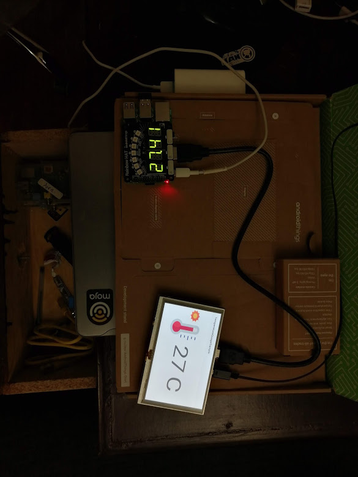

# Smart Signage with the Android Things

This sample implements Smart Signage using [Android Things](https://developer.android.com/things/index.html). It uses the [Rainbow Hat](https://shop.pimoroni.com/products/rainbow-hat-for-android-things).

The Rainbow Hat does 2 things:

* Gets Temperature Reading
* Displays the Temperature on its own 14-segment alphanumeric displays

# Demonstration at work

# Asset Credits

Icons made by Freepik from [www.flaticon.com](https://www.flaticon.com/) is licensed by CC 3.0 BY